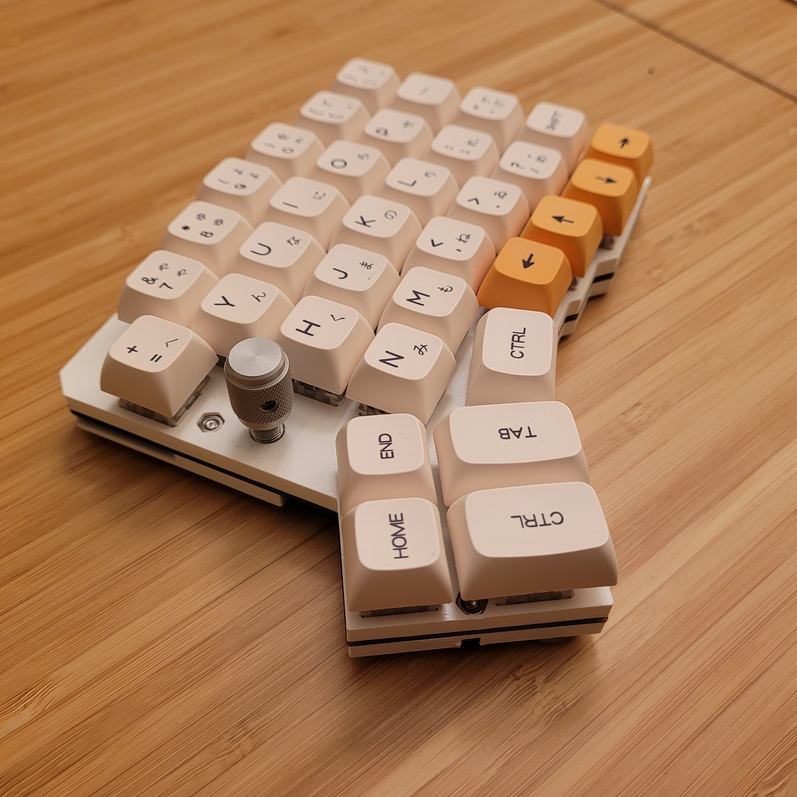

# Wireless Redox with an Rotary Encoder
This is a fork of the [Wireless Redox Keyboard by Mattia Dal Ben](https://github.com/mattdibi/redox-keyboard/blob/master/redox-w/README.md) that adds support for a rotary encoder. This repository includes the PCB files and the 3D printed files. The firmware is located in two other repositories:
 - [This fork repository for the QMK firmware](https://github.com/PhiBabin/qmk_firmware)
 - [This fork repository for the Redox-Wireless firmware](https://github.com/PhiBabin/redox-w-firmware)

Both keyboard half can have a rotary encoder. The encoder can still act as a switch when pressed. With the current default firmware, the encoder controls the volume slider.

## Limitations
Adding a rotary encoder increase the battery consumption by a lot. Usually, the keyboard half with the rotary encoder empties its battery 3x faster than the half without an encoder. I highly suggest you use [my LiPo battery adapter](https://github.com/PhiBabin/Redox-Lipo-Adapter) to add the ability to recharge your keyboard. I'm sure someone more competent can improve the firmware to reduce battery consumption.

## Materials
 Qty | Item     | Link |
|----:| -----------------------------------------------| :---------: |
|   1 | Rotary encoder              | [Link](https://www.digikey.com/en/products/detail/bourns-inc/PEC11L-4015F-S0020/4699163) |
|   1 | Knurled Knob               | [Link](https://www.digikey.com/en/products/detail/kilo-international/OEDNI-50-3-7/5970320) |

I used a rotary encoder without indentation, this was probably not a great idea, since the indentation give a good feedback of how much you turned the knob. Other rotary encoders probably will work fine, but they might require modifying the 3D printed case. The schematic and PCB includes two pullup resistors (R1 and R2) for the encoder, turns out they're not necessary and can be left unpopulated.

## Build Instructions
Follow [the original build guide](https://github.com/mattdibi/redox-keyboard/blob/master/redox-w/README.md) for the Wireless Redox keyboard, but:
 - Use a Redox-wireless PCB with an rotary encoder
 - Do not soldering a Kailh socket to the 16th Key, instead solder the rotary encoder
 - Once the keyboard is inside its case, insert the knob
 - Flash the receiver, the left and right keyboard with [modified firmware](https://github.com/PhiBabin/redox-w-firmware)
   - By default, only the right side has an encoder, [you can change that here](https://github.com/PhiBabin/redox-w-firmware/blob/master/redox-w-keyboard-basic/config/redox-w.h#L29)
 - Flash the Pro-Micro with the [modified QMK firmware](https://github.com/PhiBabin/qmk_firmware)
   - By default, the encoder can only change the volume
